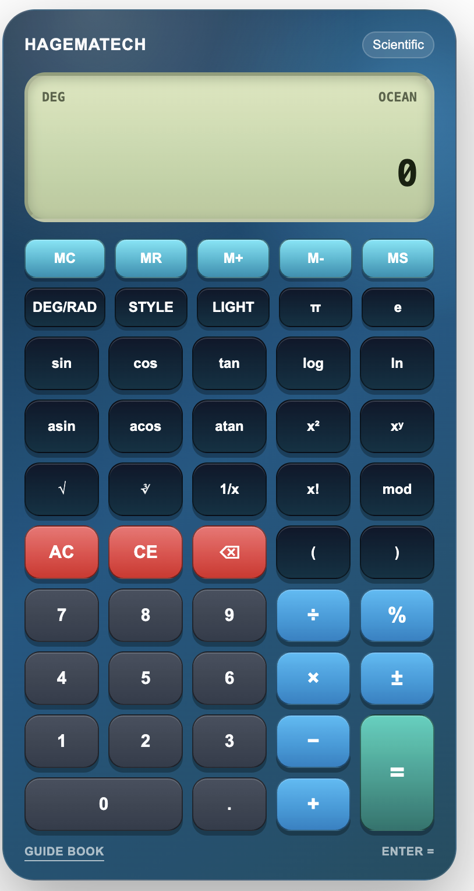
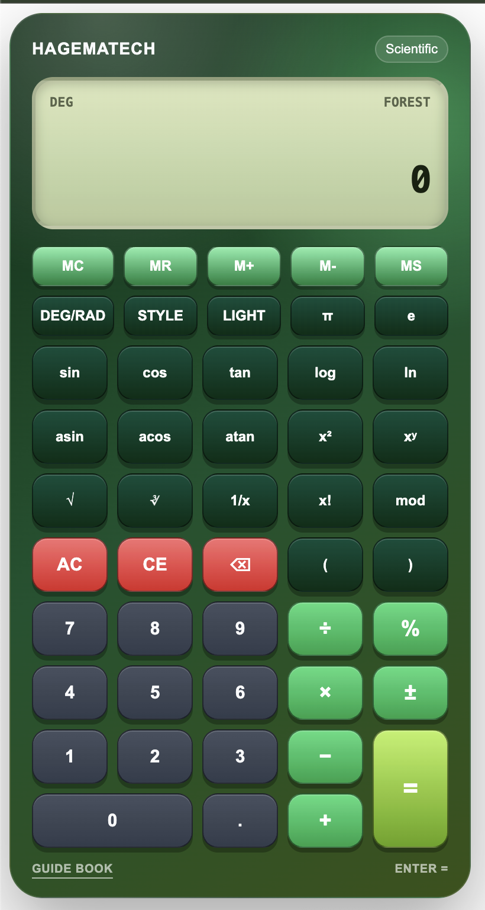
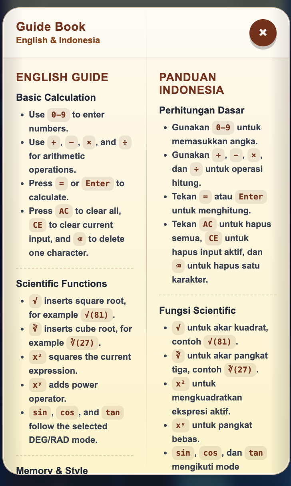

# Hagematech Calculator

A beautiful, responsive, scientific calculator Web Component with physical calculator style, custom gradients, custom hex colors, memory functions, keyboard support, and a built-in bilingual Guide Book.

Use it with one simple HTML tag:

```html
<calculator-hagematech></calculator-hagematech>
```

---

## Preview

### Default Aurora

<p align="center">
  
</p>

Copy and paste:

```html
<calculator-hagematech></calculator-hagematech>
```

---

### Ocean Gradient

<p align="center">
  
</p>

Copy and paste:

```html
<calculator-hagematech gradient="ocean"></calculator-hagematech>
```

---

### Forest Gradient

<p align="center">
  
</p>

Copy and paste:

```html
<calculator-hagematech gradient="forest"></calculator-hagematech>
```

---

### Custom Hex Color

<p align="center">
  
</p>

Copy and paste:

```html
<calculator-hagematech color="#0ea5e9"></calculator-hagematech>
```

---

### Built-in Guide Book



The calculator includes a built-in bilingual Guide Book in English and Indonesian.

---

## Features

- Scientific calculator Web Component
- Simple custom HTML tag
- Works with npm, CDN, plain HTML, React, Vue, Laravel, Next.js, Vite, Astro, and more
- Shadow DOM style isolation
- Physical calculator-style design
- Responsive mobile-friendly layout
- Professional loading state
- Professional error state
- Built-in bilingual Guide Book
- English and Indonesian usage guide
- Custom gradient themes
- Custom hexadecimal color support
- Light and dark mode
- DEG/RAD angle mode
- Memory functions
- Keyboard support
- Basic arithmetic operations
- Scientific operations
- Powered by math.js

---

## Installation

There are two main ways to use Hagematech Calculator:

1. Install with npm
2. Use directly from CDN

---

# 1. Install with npm

```bash
npm install calculator-hagematech
```

Using yarn:

```bash
yarn add calculator-hagematech
```

Using pnpm:

```bash
pnpm add calculator-hagematech
```

---

## Basic npm Usage

Import the package once in your JavaScript entry file:

```js
import 'calculator-hagematech';
```

Then use the tag anywhere in your HTML/template:

```html
<calculator-hagematech></calculator-hagematech>
```

---

## Vite Usage

### `main.js`

```js
import 'calculator-hagematech';
```

### `index.html`

```html
<calculator-hagematech></calculator-hagematech>
```

Example with gradient:

```html
<calculator-hagematech gradient="ocean"></calculator-hagematech>
```

---

## React Usage

Install:

```bash
npm install calculator-hagematech
```

Import it once:

```jsx
import 'calculator-hagematech';

export default function App() {
    return (
        <div>
            <h1>Hagematech Calculator Demo</h1>

            <calculator-hagematech></calculator-hagematech>
        </div>
    );
}
```

Example with custom attributes:

```jsx
import 'calculator-hagematech';

export default function App() {
    return (
        <calculator-hagematech
            gradient="sunset"
            theme="dark"
            angle-mode="DEG"
            precision="16"
        ></calculator-hagematech>
    );
}
```

---

## React TypeScript Support

If TypeScript shows an error for the custom element, create:

```txt
src/custom-elements.d.ts
```

Then add:

```ts
import React from 'react';

declare global {
    namespace JSX {
        interface IntrinsicElements {
            'calculator-hagematech': React.DetailedHTMLProps<
                React.HTMLAttributes<HTMLElement>,
                HTMLElement
            > & {
                gradient?: string;
                color?: string;
                theme?: string;
                'angle-mode'?: string;
                precision?: string;
                'max-length'?: string;
            };
        }
    }
}

export {};
```

---

## Vue Usage

### `main.js`

```js
import 'calculator-hagematech';
```

### Component

```vue
<template>
    <calculator-hagematech gradient="forest"></calculator-hagematech>
</template>
```

If Vue shows a warning about custom elements, configure it as a custom element.

### Vite + Vue Config

```js
export default {
    compilerOptions: {
        isCustomElement: (tag) => tag === 'calculator-hagematech'
    }
}
```

---

## Laravel + Vite Usage

Install:

```bash
npm install calculator-hagematech
```

Import in:

```txt
resources/js/app.js
```

```js
import 'calculator-hagematech';
```

Use in Blade:

```blade
<calculator-hagematech></calculator-hagematech>
```

With custom style:

```blade
<calculator-hagematech gradient="ocean" theme="dark"></calculator-hagematech>
```

---

## Next.js Usage

Because this package registers a browser custom element, import it on the client side.

```jsx
'use client';

import { useEffect } from 'react';

export default function Calculator() {
    useEffect(() => {
        import('calculator-hagematech');
    }, []);

    return (
        <calculator-hagematech gradient="aurora"></calculator-hagematech>
    );
}
```

---

## Astro Usage

Import the package in your page or layout:

```astro
---
import 'calculator-hagematech';
---

<calculator-hagematech gradient="grape"></calculator-hagematech>
```

---

# 2. CDN Usage

You can use the package directly from CDN without installing anything.

## jsDelivr CDN

```html
<script src="https://cdn.jsdelivr.net/npm/calculator-hagematech@1.0.0"></script>

<calculator-hagematech></calculator-hagematech>
```

## unpkg CDN

```html
<script src="https://unpkg.com/calculator-hagematech@1.0.0"></script>

<calculator-hagematech></calculator-hagematech>
```

If your package entry file is inside `dist`, use:

```html
<script src="https://cdn.jsdelivr.net/npm/calculator-hagematech@1.0.0/dist/calculator-hagematech.js"></script>

<calculator-hagematech></calculator-hagematech>
```

---

## Full CDN Usage

```html
<!DOCTYPE html>
<html lang="en">
<head>
    <meta charset="UTF-8">
    <title>Hagematech Calculator Demo</title>

    <script src="https://cdn.jsdelivr.net/npm/calculator-hagematech@1.0.0"></script>
</head>
<body>

    <h1>Hagematech Calculator Demo</h1>

    <calculator-hagematech></calculator-hagematech>

</body>
</html>
```

---
## Gradient Themes

Hagematech Calculator includes 6 built-in gradient themes.

| Theme | Usage |
|---|---|
| Aurora | `<calculator-hagematech gradient="aurora"></calculator-hagematech>` |
| Sunset | `<calculator-hagematech gradient="sunset"></calculator-hagematech>` |
| Ocean | `<calculator-hagematech gradient="ocean"></calculator-hagematech>` |
| Forest | `<calculator-hagematech gradient="forest"></calculator-hagematech>` |
| Grape | `<calculator-hagematech gradient="grape"></calculator-hagematech>` |
| Gold | `<calculator-hagematech gradient="gold"></calculator-hagematech>` |

Example:

```html
<calculator-hagematech gradient="ocean"></calculator-hagematech>
```

---

## Custom Hex Colors

You can also use any valid hex color.

The calculator will automatically generate a matching style from the selected color.

| Color Name | Hex Color | Usage |
|---|---|---|
| Sky Blue | `#0ea5e9` | `<calculator-hagematech color="#0ea5e9"></calculator-hagematech>` |
| Red | `#dc2626` | `<calculator-hagematech color="#dc2626"></calculator-hagematech>` |
| Green | `#16a34a` | `<calculator-hagematech color="#16a34a"></calculator-hagematech>` |
| Purple | `#7c3aed` | `<calculator-hagematech color="#7c3aed"></calculator-hagematech>` |
| Orange | `#ea580c` | `<calculator-hagematech color="#ea580c"></calculator-hagematech>` |
| Pink | `#db2777` | `<calculator-hagematech color="#db2777"></calculator-hagematech>` |
| Cyan | `#0891b2` | `<calculator-hagematech color="#0891b2"></calculator-hagematech>` |
| Emerald | `#059669` | `<calculator-hagematech color="#059669"></calculator-hagematech>` |
| Amber | `#d97706` | `<calculator-hagematech color="#d97706"></calculator-hagematech>` |
| Slate | `#475569` | `<calculator-hagematech color="#475569"></calculator-hagematech>` |
| Indigo | `#4f46e5` | `<calculator-hagematech color="#4f46e5"></calculator-hagematech>` |
| Rose | `#e11d48` | `<calculator-hagematech color="#e11d48"></calculator-hagematech>` |

Example:

```html
<calculator-hagematech color="#7c3aed"></calculator-hagematech>
```

---

## Color Rules

Use a valid 3-digit or 6-digit hex color.

Valid examples:

```html
<calculator-hagematech color="#0ea5e9"></calculator-hagematech>
<calculator-hagematech color="#f00"></calculator-hagematech>
```

Invalid examples:

```html
<calculator-hagematech color="blue"></calculator-hagematech>
<calculator-hagematech color="rgb(14, 165, 233)"></calculator-hagematech>
```

---

## Gradient vs Custom Color

Use `gradient` if you want one of the built-in themes.

```html
<calculator-hagematech gradient="forest"></calculator-hagematech>
```

Use `color` if you want your own custom color.

```html
<calculator-hagematech color="#16a34a"></calculator-hagematech>
```

If `color` is provided, the calculator will use the custom color style.
